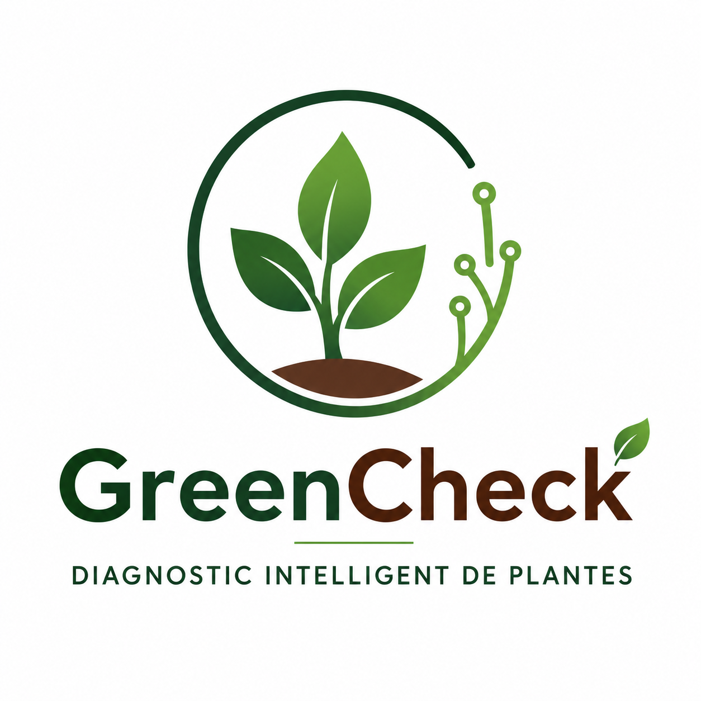

# CDC GreenCheck

Sujet de projet fil rouge pour la formation Concepteur, Développeur spécialité Intégration IA - Année 2026

1. Copier backend/.env.example  → backend/.env  et remplir les valeurs
2. Copier frontend/.env.example → frontend/.env et remplir les valeurs
3. Lancer le conteneur MariaDB : docker compose up -d
4. Lancer le backend           : cd backend && python main.py
5. Lancer le frontend          : cd frontend && npm run dev